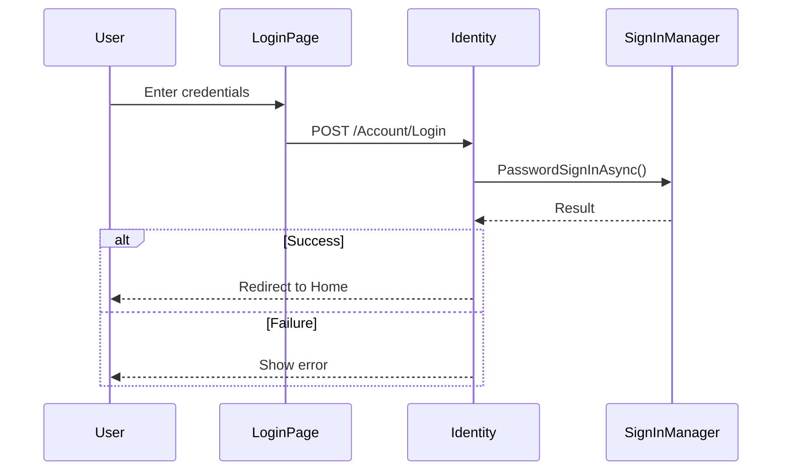
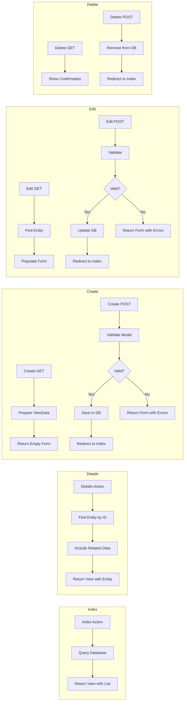

# EpicMarket Admin MVC - Screens Documentation

> **Complete Guide to Admin Panel Screens** - UI elements, behaviors, validations, and API integration

---

## Table of Contents

- [Overview](#overview)
- [Application Layout](#application-layout)
- [Authentication](#authentication)
- [Screen Categories](#screen-categories)
- [Dashboard & Home](#dashboard--home)
- [Business Management](#business-management)
  - [Businesses](#businesses)
  - [Catalogs (Products)](#catalogs-products)
  - [Outlets (Branches)](#outlets-branches)
  - [Employees](#employees)
  - [Orders](#orders)
- [Application Settings](#application-settings)
- [User Management](#user-management)
- [OptionSets & Lookups](#optionsets--lookups)
- [Content Management](#content-management)
- [Support & Tasks](#support--tasks)
- [Controller-View Flow](#controller-view-flow)
- [Common Patterns](#common-patterns)

---

## Overview

The EpicMarket Admin MVC application (`EpicMarket.Admin.MVC`) is a server-side rendered web application built with ASP.NET Core MVC. It provides a comprehensive administrative interface for managing the EpicMarket platform.

### Key Features

- **Role-based access**: Admin-only access for all features
- **CRUD operations**: Full Create, Read, Update, Delete for all entities
- **DataTables integration**: Sortable, searchable tables
- **Responsive design**: Bootstrap 5-based UI
- **Rich text editing**: TinyMCE integration for content
- **Real-time validation**: Client and server-side validation

### Technology Stack

| Component | Technology |
|-----------|------------|
| Framework | ASP.NET Core 8.0 MVC |
| Authentication | ASP.NET Core Identity |
| CSS Framework | Bootstrap 5 |
| Icons | BoxIcons |
| Tables | DataTables.js |
| Rich Editor | TinyMCE |
| JavaScript | jQuery |

---

## Application Layout

### Main Layout Structure

```
┌─────────────────────────────────────────────────────────────────────────┐
│                              HEADER                                      │
│  ┌─────────┐  ┌──────────────────────────────────────────────────────┐  │
│  │ Toggle  │  │  Search | Apps | Notifications | Messages | Profile  │  │
│  └─────────┘  └──────────────────────────────────────────────────────┘  │
├─────────────────────────────────────────────────────────────────────────┤
│ ┌──────────────┐ ┌─────────────────────────────────────────────────────┐│
│ │              │ │                                                     ││
│ │   SIDEBAR    │ │                    CONTENT AREA                     ││
│ │              │ │                                                     ││
│ │  • Home      │ │  ┌───────────────────────────────────────────────┐ ││
│ │  • Settings  │ │  │           Breadcrumb Navigation                │ ││
│ │  • Users     │ │  └───────────────────────────────────────────────┘ ││
│ │  • Business  │ │  ┌───────────────────────────────────────────────┐ ││
│ │  • Orders    │ │  │              Action Buttons                    │ ││
│ │  • Tasks     │ │  └───────────────────────────────────────────────┘ ││
│ │              │ │  ┌───────────────────────────────────────────────┐ ││
│ │              │ │  │                                               │ ││
│ │              │ │  │              Page Content                     │ ││
│ │              │ │  │          (Tables, Forms, etc.)                │ ││
│ │              │ │  │                                               │ ││
│ │              │ │  └───────────────────────────────────────────────┘ ││
│ │              │ │                                                     ││
│ └──────────────┘ └─────────────────────────────────────────────────────┘│
├─────────────────────────────────────────────────────────────────────────┤
│                              FOOTER                                      │
│                    Copyright © 2024 EpicMarket                          │
└─────────────────────────────────────────────────────────────────────────┘
```

### Navigation Menu Structure

```
├── Home
├── Application Settings
│   ├── Application Configurations
│   ├── Application Securables
│   ├── Applications
│   ├── Access Control List
│   ├── Entities
│   ├── Access Types OptionSet
│   └── Pages
├── Communications
│   └── Communication Queue
├── App Users
│   ├── Users
│   └── Roles
├── Internal
│   ├── Business Categories (Internal)
│   └── Product (Internal)
├── OptionSets
│   ├── Contact Methods
│   ├── Events
│   ├── Event Categories
│   ├── Person Types
│   ├── Support Queries
│   └── Status OptionSet
├── Leads
│   └── Promotional Leads
├── Attachments
│   ├── Attachment Types
│   └── Attachments
├── Blogs
│   ├── Blogs
│   └── Blog Categories
├── FAQs
│   ├── FAQ Categories
│   └── FAQs
├── Businesses
│   ├── Businesses
│   └── Event Logs
├── Catalogs
├── Employees
├── Outlets
│   ├── Outlets
│   ├── Outlet Persons
│   └── Outlet Products
├── Orders
│   ├── Orders
│   ├── Order Details
│   ├── Order Status Options
│   └── Order Type Options
└── Tasks
    ├── Tasks
    ├── Task Types
    └── Task Status OptionSet
```

---

## Authentication

### Login Screen

**Route:** `/Identity/Account/Login`

![Login Screen Placeholder]

**Purpose:** Authenticates administrators to access the admin panel.

**UI Elements:**

| Element | Type | Validation |
|---------|------|------------|
| Email | Text Input | Required, Email format |
| Password | Password Input | Required |
| Remember Me | Checkbox | Optional |
| Login Button | Submit Button | - |
| Forgot Password | Link | - |

**Behavior:**
- Successful login redirects to Home/Index
- Failed login shows error message
- Account lockout after multiple failed attempts
- Two-factor authentication support

**Controller Flow:**



### Manage Account

**Route:** `/Identity/Account/Manage`

**Features:**
- Profile information update
- Change password
- Two-factor authentication setup
- Recovery codes generation

---

## Screen Categories

The admin panel is organized into the following categories:

| Category | Description | Primary Entities |
|----------|-------------|------------------|
| **Dashboard** | Overview and welcome | - |
| **Business Management** | Core business operations | Business, Catalog, Outlet, Order |
| **Application Settings** | System configuration | Configurations, Securables, ACL |
| **User Management** | Users and roles | AppUser, AppUserRole |
| **OptionSets** | Lookup data | Status, Events, Types |
| **Content Management** | Public content | Blogs, FAQs |
| **Support & Tasks** | Internal workflow | Tasks, Support Tickets |

---

## Dashboard & Home

### Home Index

**Route:** `/Home/Index`

**Controller:** `HomeController`

**View:** `Views/Home/Index.cshtml`

![Home Screen Placeholder]

**Purpose:** Welcome dashboard for administrators.

**UI Elements:**

| Element | Description |
|---------|-------------|
| Welcome Message | Personalized greeting with time of day |
| User Name | Current logged-in user's first name |
| Dashboard Cards | Summary statistics (future) |

**Behavior:**
- Displays time-appropriate greeting (Good Morning/Afternoon/Evening)
- Shows logged-in user's first name
- Serves as the landing page after login

**Controller Code:**

```csharp
public IActionResult Index()
{
    var userName = this.User.FindFirst(ClaimTypes.Name).Value;
    ViewBag.Firstname = this.context.Users
        .FirstOrDefault(u => u.UserName == userName).FirstName;
    
    int hour = DateTime.Now.Hour;
    ViewBag.TypeofMessage = hour < 12 ? "Good Morning" 
                          : hour < 18 ? "Good Afternoon" 
                          : "Good Evening";
    return View();
}
```

**API Calls:** None (direct database access)

---

## Business Management

### Businesses

#### Business List (Index)

**Route:** `/Businesses`

**Controller:** `BusinessesController`

**View:** `Views/Businesses/Index.cshtml`

**Model:** `IEnumerable<Business>`

![Business List Placeholder]

**Purpose:** Display all registered businesses with management options.

**UI Elements:**

| Element | Type | Description |
|---------|------|-------------|
| Create New Button | Link | Navigate to Create page |
| Business Table | DataTable | Sortable, searchable list |
| Edit Link | Action Link | Navigate to Edit page |
| Details Link | Action Link | Navigate to Details page |
| Delete Link | Action Link | Navigate to Delete page |

**Table Columns:**

| Column | Description |
|--------|-------------|
| ID | Business identifier |
| Name | Business name |
| Contact Number | Phone number |
| Contact Email | Email address |
| Rating | Average rating |
| IsOpen | Open status |
| Weight | Priority weight |
| Status | Approval status |
| Person | Owner username |
| Business Category | Category name |
| City | Location city |
| Actions | Edit, Details, Delete |

**Behavior:**
- DataTables provides sorting and filtering
- Clicking action links navigates to respective pages
- Data loaded with related entities (Address, Category, Person, Status)

**Controller Code:**

```csharp
public async Task<IActionResult> Index()
{
    var applicationDbContext = _context.Businesses
        .Include(b => b.Address)
        .Include(b => b.BusinessCategory)
        .Include(b => b.Person)
        .Include(b => b.Status);
    return View(await applicationDbContext.ToListAsync());
}
```

---

#### Business Details

**Route:** `/Businesses/Details/{id}`

**View:** `Views/Businesses/Details.cshtml`

**Model:** `BusinessDetailModel`

![Business Details Placeholder]

**Purpose:** Show complete business information with related entities.

**UI Elements:**

| Section | Content |
|---------|---------|
| Business Info | Name, Description, Contact, Status |
| Address | Full address details |
| Outlets Table | List of branches |
| Employees Table | List of employees |
| Products Table | List of catalog items |

**Model Structure:**

```csharp
public class BusinessDetailModel
{
    public Business Business { get; set; }
    public List<Outlet> Outlets { get; set; }
    public List<BusinessEmployeeMap> employees { get; set; }
    public List<Catalog> Catalogs { get; set; }
}
```

**Behavior:**
- Displays comprehensive business information
- Shows related branches, employees, and products
- Provides navigation to related entity details

---

#### Business Create

**Route:** `/Businesses/Create`

**View:** `Views/Businesses/Create.cshtml`

**Model:** `Business`

![Business Create Placeholder]

**Purpose:** Create a new business registration.

**Form Fields:**

| Field | Type | Validation | Description |
|-------|------|------------|-------------|
| PersonID | Dropdown | Required | Business owner |
| BusinessCategoryID | Dropdown | Required | Category selection |
| Name | Text | Required | Business name |
| Description | Textarea | Required | Description |
| ContactNumber | Number | Required | Phone number |
| ContactEmail | Email | Required | Email address |
| StatusID | Dropdown | Required | Initial status |
| Address.Line1 | Text | Required | Street address |
| Address.City | Text | Required | City |
| Address.State | Text | Required | State |
| Address.Pincode | Text | Required | Postal code |

**Validations:**
- All required fields must be filled
- Email must be valid format
- Server-side validation on submit

**Controller Code:**

```csharp
[HttpPost]
[ValidateAntiForgeryToken]
public async Task<IActionResult> Create([Bind("ID,PersonID,...")] Business business)
{
    var userName = this.User.FindFirst(ClaimTypes.Name).Value;
    business.Address.CreateBy = userName;
    business.Address.CreateDate = DateTime.UtcNow;
    business.CreateBy = userName;
    business.CreateDate = DateTime.UtcNow;

    if (ModelState.IsValid)
    {
        _context.Add(business);
        await _context.SaveChangesAsync();
        return RedirectToAction(nameof(Index));
    }
    // Repopulate dropdowns on error
    return View(business);
}
```

---

#### Business Edit

**Route:** `/Businesses/Edit/{id}`

**View:** `Views/Businesses/Edit.cshtml`

**Model:** `Business`

![Business Edit Placeholder]

**Purpose:** Update existing business information.

**Behavior:**
- Pre-populates form with existing data
- Tracks modification metadata
- Validates changes before saving

---

#### Business Delete

**Route:** `/Businesses/Delete/{id}`

**View:** `Views/Businesses/Delete.cshtml`

**Model:** `Business`

![Business Delete Placeholder]

**Purpose:** Confirm and delete a business.

**Behavior:**
- Shows business details for confirmation
- Requires explicit confirmation
- Removes business record on confirm

---

### Catalogs (Products)

#### Catalog List

**Route:** `/Catalogs`

**Controller:** `CatalogsController`

**View:** `Views/Catalogs/Index.cshtml`

**Model:** `IEnumerable<Catalog>`

![Catalog List Placeholder]

**Purpose:** Manage product catalog items.

**Table Columns:**

| Column | Description |
|--------|-------------|
| ID | Product identifier |
| BusinessID | Associated business |
| Barcode | Product barcode |
| Name | Product name |
| Category | Product category |
| Rate | Price |
| InStock | Stock status |
| IsRecommended | Featured flag |
| Status | Approval status |
| Actions | Edit, Details, Delete |

**Behavior:**
- DataTables with search and sort
- Links to business details
- Status indicator badges

---

#### Catalog Create/Edit

**Route:** `/Catalogs/Create`, `/Catalogs/Edit/{id}`

**Form Fields:**

| Field | Type | Validation |
|-------|------|------------|
| BusinessID | Dropdown | Required |
| Barcode | Number | Optional |
| Name | Text (50 chars) | Required |
| Description | Textarea | Required |
| Category | Text | Optional |
| Rate | Decimal | Required |
| InStock | Checkbox | - |
| IsRecommended | Checkbox | - |
| MaximumOrderPurchase | Number | Optional |
| StatusId | Dropdown | Required |

---

### Outlets (Branches)

#### Outlet List

**Route:** `/Outlets`

**Controller:** `OutletsController`

**View:** `Views/Outlets/Index.cshtml`

**Model:** `IEnumerable<Outlet>`

![Outlet List Placeholder]

**Purpose:** Manage business branches/outlets.

**Table Columns:**

| Column | Description |
|--------|-------------|
| ID | Outlet identifier |
| Name | Outlet name |
| Business | Parent business |
| Contact Number | Phone |
| Contact Email | Email |
| City | Location |
| Status | Active/Inactive |
| IsOpen | Open status |
| Actions | Edit, Details, Delete |

---

#### Outlet Details

**Route:** `/Outlets/Details/{id}`

**Model:** `OutletsDetailsModel`

**Purpose:** Show outlet with related orders, employees, and products.

**Model Structure:**

```csharp
public class OutletsDetailsModel
{
    public Outlet Outlet { get; set; }
    public List<Order> Orders { get; set; }
    public List<OutletProduct> OutletProducts { get; set; }
    public List<OutletPerson> OutletEmployees { get; set; }
}
```

**Sections:**
- Outlet Information
- Orders Table
- Assigned Products
- Assigned Employees

---

### Employees

#### Employee List

**Route:** `/BusinessEmployeeMaps`

**Controller:** `BusinessEmployeeMapsController`

**View:** `Views/BusinessEmployeeMaps/Index.cshtml`

![Employee List Placeholder]

**Purpose:** View business-employee relationships.

**Table Columns:**

| Column | Description |
|--------|-------------|
| ID | Mapping ID |
| Business | Business name |
| Employee | Employee username |
| IsActive | Active status |
| Actions | Edit, Details, Delete |

---

### Orders

#### Order List

**Route:** `/Orders`

**Controller:** `OrdersController`

**View:** `Views/Orders/Index.cshtml`

**Model:** `IEnumerable<Order>`

![Order List Placeholder]

**Purpose:** View and manage all orders.

**Table Columns:**

| Column | Description |
|--------|-------------|
| ID | Order number |
| Person | Customer |
| Outlet | Branch |
| Order Type | Online/Offline |
| Total Price | Order value |
| Total Items | Item count |
| Order At | Date/time |
| Status | Order status |
| Payment Mode | Cash/Online |
| Actions | Edit, Details, Delete |

---

#### Order Details

**Route:** `/Orders/Details/{id}`

**Model:** `OrderDetailsModel`

![Order Details Placeholder]

**Purpose:** Show complete order with line items.

**Model Structure:**

```csharp
public class OrderDetailsModel
{
    public Order Order { get; set; }
    public List<OrderDetail> OrderDetails { get; set; }
}
```

**Sections:**
- Order Header (Customer, Date, Status, Payment)
- Business/Outlet Information
- Delivery Address
- Order Items Table (Product, Quantity, Price)

---

## Application Settings

### Application Configurations

**Route:** `/ApplicationConfigurations`

**Purpose:** System-wide configuration settings.

**Table Columns:**

| Column | Description |
|--------|-------------|
| Key | Configuration key |
| Value | Configuration value |
| Description | Purpose description |

---

### Application Securables

**Route:** `/ApplicationSecurables`

**Purpose:** Define permission securables for the system.

**Table Columns:**

| Column | Description |
|--------|-------------|
| Name | Securable name |
| Description | Purpose |
| Application | Associated app |

---

### Access Control Lists

**Route:** `/AccessControlLists`

**Purpose:** Manage role-based permissions.

**Table Columns:**

| Column | Description |
|--------|-------------|
| Role | User role |
| Securable | Permission |
| Access Type | Allow/Deny |

---

## User Management

### Users

**Route:** `/AppUsers`

**Controller:** `AppUsersController`

**View:** `Views/AppUsers/Index.cshtml`

**Model:** `IEnumerable<AppUser>`

![Users List Placeholder]

**Purpose:** Manage application users.

**Table Columns:**

| Column | Description |
|--------|-------------|
| ID | User ID |
| UserName | Login username |
| Email | Email address |
| FirstName | First name |
| LastName | Last name |
| Phone | Phone number |
| IsActive | Active status |
| Actions | Edit, Details, Delete |

**Note:** No Create action - users register via API.

---

#### User Edit

**Route:** `/AppUsers/Edit/{id}`

**Form Fields:**

| Field | Type | Description |
|-------|------|-------------|
| FirstName | Text | First name |
| LastName | Text | Last name |
| UserName | Text | Username |
| Email | Email | Email address |
| PhoneNumber | Text | Phone |
| LockoutEnabled | Checkbox | Enable lockout |

**Behavior:**
- Updates user profile
- Normalizes username and email
- Updates LastActive timestamp

---

### Roles

**Route:** `/AppUserRoles`

**Purpose:** Manage user role assignments.

**Table Columns:**

| Column | Description |
|--------|-------------|
| User | Username |
| Role | Assigned role |

---

## OptionSets & Lookups

### Status OptionSet

**Route:** `/StatusOptionSets`

**Purpose:** Define status values used across entities.

**Common Statuses:**
- Pending
- Approved
- Rejected
- Active
- Inactive

---

### Event Categories

**Route:** `/EventCategories`

**Purpose:** Categorize system events for logging.

---

### Person Types

**Route:** `/PersonTypes`

**Purpose:** Define person type classifications.

---

### Contact Methods

**Route:** `/ContactMethods`

**Purpose:** Define communication channel types.

---

## Content Management

### Blogs

**Route:** `/Blogs`

**Controller:** `BlogsController`

**View:** `Views/Blogs/Index.cshtml`

![Blogs List Placeholder]

**Purpose:** Manage blog posts for the public website.

**Form Fields:**

| Field | Type | Description |
|-------|------|-------------|
| Title | Text | Blog title |
| Content | Rich Text (TinyMCE) | Blog content |
| Category | Dropdown | Blog category |
| Author | Text | Author name |
| PublishDate | DateTime | Publication date |
| IsPublished | Checkbox | Visibility flag |

**TinyMCE Integration:**
```javascript
tinymce.init({
    selector: 'textarea.content-editor',
    plugins: 'link image code table',
    toolbar: 'undo redo | formatselect | bold italic | alignleft aligncenter alignright | bullist numlist | link image | code'
});
```

---

### FAQs

**Route:** `/FAQs`

**Controller:** `FAQsController`

![FAQs List Placeholder]

**Purpose:** Manage frequently asked questions.

**Form Fields:**

| Field | Type | Description |
|-------|------|-------------|
| Question | Text | FAQ question |
| Answer | Rich Text | FAQ answer |
| Category | Dropdown | FAQ category |
| SortOrder | Number | Display order |

---

### Blog Categories

**Route:** `/BlogCategories`

**Purpose:** Categorize blog posts.

---

### FAQ Categories

**Route:** `/FAQCategories`

**Purpose:** Categorize FAQs by type.

---

## Support & Tasks

### Tasks

**Route:** `/Tasks`

**Controller:** `TasksController`

**View:** `Views/Tasks/Index.cshtml`

**Model:** `IEnumerable<Tasks>`

![Tasks List Placeholder]

**Purpose:** Manage internal support tasks and workflow.

**Table Columns:**

| Column | Description |
|--------|-------------|
| ID | Task ID |
| Name | Task name |
| Type | Task type |
| Status | Current status |
| Priority | Priority level |
| Assigned To | Assigned person |
| Due Date | Due date |
| Actions | Edit, Details, Delete |

---

#### Task Create

**Route:** `/Tasks/Create`

![Task Create Placeholder]

**Form Fields:**

| Field | Type | Validation | Description |
|-------|------|------------|-------------|
| Name | Text | Required | Task name |
| Description | Textarea | Required | Task description |
| TaskTypeID | Dropdown | Required | Task type |
| ParentID | Dropdown | Optional | Parent task |
| TaskStatusID | Dropdown | Required | Initial status |
| TaskPriorityID | Dropdown | Required | Priority (Critical, High, Normal, Low) |
| PrimaryAssignedToPersonID | Dropdown | Required | Assigned admin |

**Priority Options:**
- 1: Critical
- 2: High
- 3: Normal
- 4: Low

**Auto-calculated Fields:**
- DateDue: Based on TaskType.DefaultDueDateHours
- DateAssigned: Current datetime
- ReceivedDate: Current datetime
- SubmittedByPersonID: Current user

---

#### Task Details

**Route:** `/Tasks/Details/{id}`

**Model:** `TaskDetailsModel`

![Task Details Placeholder]

**Purpose:** View task with subtasks, event logs, and comments.

**Model Structure:**

```csharp
public class TaskDetailsModel
{
    public Tasks Task { get; set; }
    public List<Tasks> SubTasks { get; set; }
    public List<EventLog> EventLogs { get; set; }
    public List<Comment> Comments { get; set; }
}
```

**Sections:**
- Task Information
- Subtasks Table
- Activity Timeline (Event Logs)
- Comments Section with Add Comment form

**Add Comment Form:**

```html
<form method="post" action="/Tasks/AddComment">
    <input type="hidden" name="taskId" value="@Model.Task.ID" />
    <textarea name="commentText" required></textarea>
    <button type="submit">Add Comment</button>
</form>
```

---

#### Task Edit

**Route:** `/Tasks/Edit/{id}`

![Task Edit Placeholder]

**Behavior:**
- Tracks field changes for event logging
- Auto-updates DateAssigned on assignment change
- Auto-updates DateStarted when status changes from "New"
- Auto-updates DateCompleted when status is "Closed"
- Creates EventLog record for changes

**Change Tracking:**

```csharp
if (existingTask.PrimaryAssignedToPersonID != tasks.PrimaryAssignedToPersonID)
{
    tasks.DateAssigned = DateTime.UtcNow;
    changes.Add("assignment");
}
if (existingTask.TaskStatusID != tasks.TaskStatusID)
{
    changes.Add("status");
}
// ... more change detection
```

---

### Task Types

**Route:** `/TaskTypes`

**Purpose:** Define types of tasks with default due dates.

**Form Fields:**

| Field | Type | Description |
|-------|------|-------------|
| Name | Text | Type name |
| Description | Textarea | Type description |
| DefaultDueDateHours | Number | Hours until due |

---

### Task Status Types

**Route:** `/TaskStatusTypes`

**Purpose:** Define task status workflow.

**Common Statuses:**
- New
- In Progress
- On Hold
- Completed
- Closed

---

## Controller-View Flow

### Standard CRUD Pattern

All entity controllers follow the same pattern:



### Route Conventions

| Action | HTTP Method | Route | View |
|--------|-------------|-------|------|
| Index | GET | `/{controller}` | `Index.cshtml` |
| Details | GET | `/{controller}/Details/{id}` | `Details.cshtml` |
| Create | GET | `/{controller}/Create` | `Create.cshtml` |
| Create | POST | `/{controller}/Create` | `Create.cshtml` |
| Edit | GET | `/{controller}/Edit/{id}` | `Edit.cshtml` |
| Edit | POST | `/{controller}/Edit/{id}` | `Edit.cshtml` |
| Delete | GET | `/{controller}/Delete/{id}` | `Delete.cshtml` |
| Delete | POST | `/{controller}/Delete/{id}` | Redirect |

---

## Common Patterns

### Authorization

All controllers require Admin role:

```csharp
[Authorize(Roles = $"{ROLES.ADMIN}")]
public class BusinessesController : Controller
```

### Audit Fields

Create and Edit actions set audit fields:

```csharp
// Create
entity.CreateBy = this.User.FindFirst(ClaimTypes.Name).Value;
entity.CreateDate = DateTime.UtcNow;

// Edit
entity.ModifiedBy = this.User.FindFirst(ClaimTypes.Name).Value;
entity.ModifiedDate = DateTime.UtcNow;
```

### ViewData for Dropdowns

Dropdowns are populated via ViewData:

```csharp
ViewData["BusinessCategoryID"] = new SelectList(_context.BusinessCategories, "ID", "Name");
ViewData["StatusID"] = new SelectList(_context.StatusOptionSets, "Id", "Status");
```

### Concurrency Handling

Edit actions handle concurrency:

```csharp
try
{
    _context.Update(entity);
    await _context.SaveChangesAsync();
}
catch (DbUpdateConcurrencyException)
{
    if (!EntityExists(entity.ID))
        return NotFound();
    else
        throw;
}
```

### DataTables Initialization

All index views use DataTables:

```javascript
@section Scripts {
    <script>
        $(document).ready(function () {
            $('#example').DataTable();
        });
    </script>
}
```

### Anti-Forgery Tokens

All POST forms include CSRF protection:

```csharp
[HttpPost]
[ValidateAntiForgeryToken]
public async Task<IActionResult> Create([Bind("...")] Entity entity)
```

### Model Binding

Specific properties are bound to prevent over-posting:

```csharp
public async Task<IActionResult> Edit(int id, 
    [Bind("ID,Name,Description,StatusId,...")] Entity entity)
```

---

## API Integration

The MVC Admin Panel does **not** call the API directly. Instead, it uses direct database access via Entity Framework Core's `ApplicationDbContext`.

### Database Context Usage

```csharp
private readonly ApplicationDbContext _context;

public BusinessesController(ApplicationDbContext context)
{
    _context = context;
}
```

### Query Patterns

```csharp
// List with includes
var businesses = await _context.Businesses
    .Include(b => b.Address)
    .Include(b => b.BusinessCategory)
    .Include(b => b.Person)
    .Include(b => b.Status)
    .ToListAsync();

// Single item with includes
var business = await _context.Businesses
    .Include(b => b.Address)
    .FirstOrDefaultAsync(m => m.ID == id);

// Related data queries
var orders = await _context.Orders
    .Where(o => o.OutletID == id)
    .Include(o => o.Address)
    .ToListAsync();
```

---

## Screenshots Placeholders

> **Note:** Replace the following placeholders with actual screenshots.

### Screenshot Locations

| Screen | Placeholder | File Location |
|--------|-------------|---------------|
| Login | `[Login Screen Placeholder]` | `/docs/screenshots/login.png` |
| Home | `[Home Screen Placeholder]` | `/docs/screenshots/home.png` |
| Business List | `[Business List Placeholder]` | `/docs/screenshots/business-list.png` |
| Business Details | `[Business Details Placeholder]` | `/docs/screenshots/business-details.png` |
| Business Create | `[Business Create Placeholder]` | `/docs/screenshots/business-create.png` |
| Business Edit | `[Business Edit Placeholder]` | `/docs/screenshots/business-edit.png` |
| Business Delete | `[Business Delete Placeholder]` | `/docs/screenshots/business-delete.png` |
| Catalog List | `[Catalog List Placeholder]` | `/docs/screenshots/catalog-list.png` |
| Outlet List | `[Outlet List Placeholder]` | `/docs/screenshots/outlet-list.png` |
| Employee List | `[Employee List Placeholder]` | `/docs/screenshots/employee-list.png` |
| Order List | `[Order List Placeholder]` | `/docs/screenshots/order-list.png` |
| Order Details | `[Order Details Placeholder]` | `/docs/screenshots/order-details.png` |
| Users List | `[Users List Placeholder]` | `/docs/screenshots/users-list.png` |
| Blogs List | `[Blogs List Placeholder]` | `/docs/screenshots/blogs-list.png` |
| FAQs List | `[FAQs List Placeholder]` | `/docs/screenshots/faqs-list.png` |
| Tasks List | `[Tasks List Placeholder]` | `/docs/screenshots/tasks-list.png` |
| Task Create | `[Task Create Placeholder]` | `/docs/screenshots/task-create.png` |
| Task Details | `[Task Details Placeholder]` | `/docs/screenshots/task-details.png` |
| Task Edit | `[Task Edit Placeholder]` | `/docs/screenshots/task-edit.png` |

---

## Related Documentation

- [Main README](./README.md) - Solution overview
- [API Documentation](./API_DOCS.md) - API endpoint reference

---

## Appendix: All Controllers

| Controller | Views | Entity | CRUD |
|------------|-------|--------|------|
| `AccessControlListsController` | 5 | AccessControlList | Full |
| `AccessTypesController` | 5 | AccessType | Full |
| `AddressesController` | 5 | Address | Full |
| `ApplicationConfigurationsController` | 5 | ApplicationConfiguration | Full |
| `ApplicationSecurablesController` | 5 | ApplicationSecurable | Full |
| `ApplicationsTablesController` | 5 | ApplicationsTable | Full |
| `AppUserRolesController` | 5 | AppUserRole | Full |
| `AppUsersController` | 4 | AppUser | R,U,D |
| `AttachmentsController` | 5 | Attachment | Full |
| `AttachmentTypesController` | 5 | AttachmentType | Full |
| `BlogCategoriesController` | 5 | BlogCategory | Full |
| `BlogsController` | 5 | Blog | Full |
| `BusinessCategoryInternalsController` | 5 | BusinessCategoryInternal | Full |
| `BusinessEmployeeMapsController` | 5 | BusinessEmployeeMap | Full |
| `BusinessesController` | 5 | Business | Full |
| `CatalogsController` | 5 | Catalog | Full |
| `CommunicationQueuesController` | 3 | CommunicationQueue | R |
| `ContactMethodsController` | 5 | ContactMethod | Full |
| `EntitiesController` | 5 | Entity | Full |
| `EventCategoriesController` | 5 | EventCategory | Full |
| `EventLogsController` | 2 | EventLog | R |
| `EventsController` | 5 | Event | Full |
| `FAQCategoriesController` | 5 | FAQCategory | Full |
| `FAQsController` | 5 | FAQ | Full |
| `HomeController` | 2 | - | - |
| `OrderDetailsController` | 5 | OrderDetail | Full |
| `OrdersController` | 5 | Order | Full |
| `OrderStatusOptionsController` | 5 | OrderStatusOptions | Full |
| `OrderTypesOptionsController` | 5 | OrderTypesOptions | Full |
| `OutletPersonsController` | 5 | OutletPerson | Full |
| `OutletProductsController` | 5 | OutletProduct | Full |
| `OutletsController` | 5 | Outlet | Full |
| `PagesController` | 5 | Page | Full |
| `PersonTypesController` | 5 | PersonType | Full |
| `ProductInternalsController` | 5 | ProductInternal | Full |
| `PromotionalLeadsController` | 5 | PromotionalLeads | Full |
| `StatusOptionSetsController` | 5 | StatusOptionSet | Full |
| `SupportQuerysController` | 5 | SupportQuerys | Full |
| `SupportTicketsController` | 5 | SupportTicket | Full |
| `TasksController` | 5 | Tasks | Full |
| `TaskStatusTypesController` | 5 | TaskStatusType | Full |
| `TaskTypesController` | 5 | TaskType | Full |

**CRUD Legend:**
- **Full**: Create, Read, Update, Delete
- **R**: Read only
- **R,U,D**: Read, Update, Delete (no Create)
