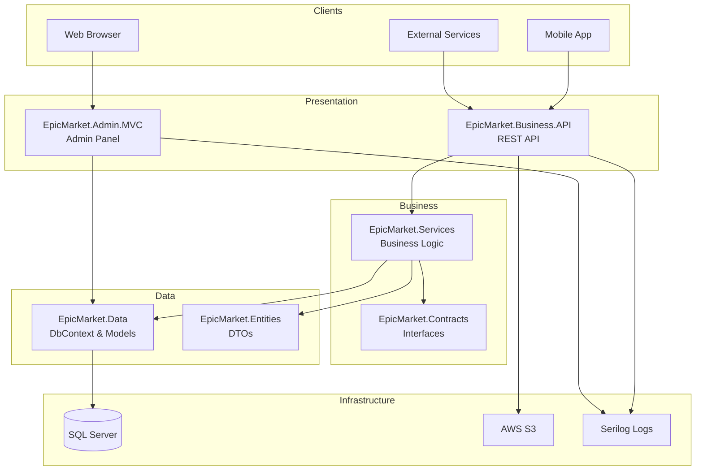
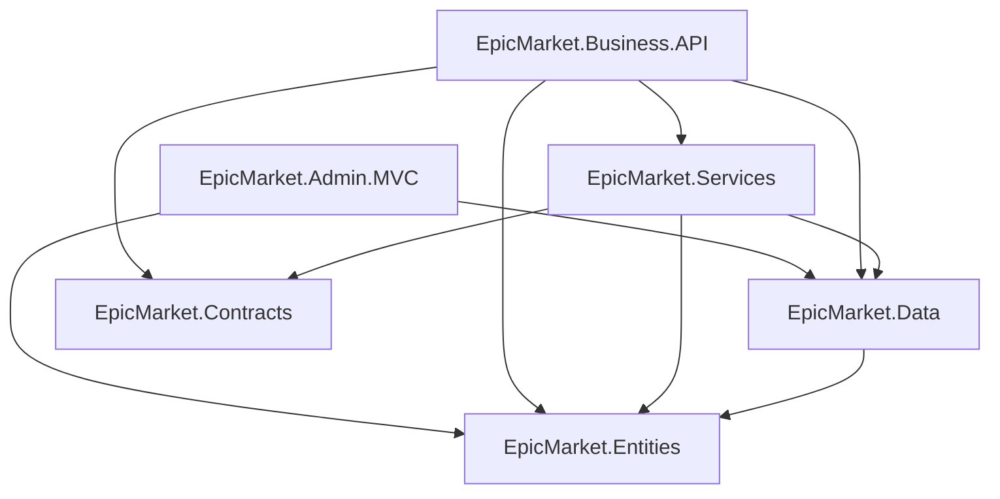
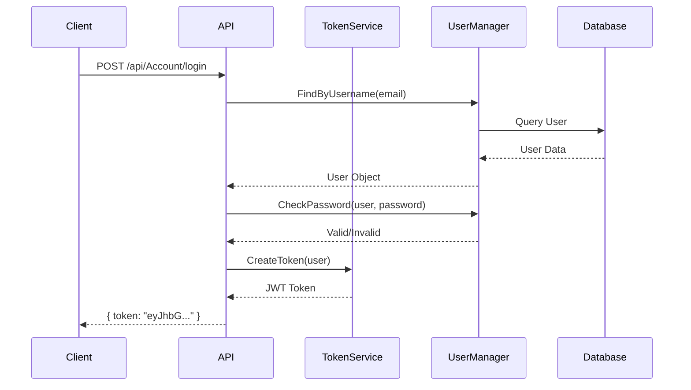
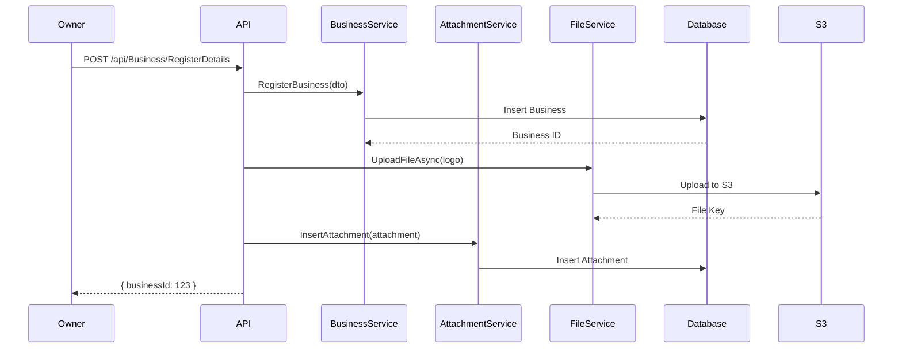
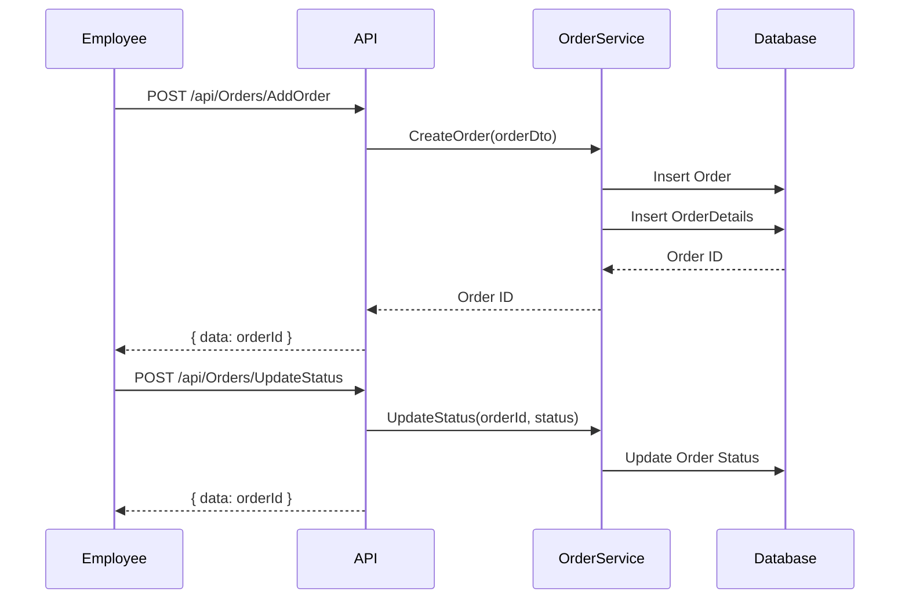

# EpicMarket Solution

> **Enterprise Business Management Platform** - A comprehensive solution for managing businesses, products, orders, branches, and employees with a RESTful API backend and administrative MVC frontend.

---

## Table of Contents

- [Overview](#overview)
- [Architecture](#architecture)
- [Technology Stack](#technology-stack)
- [Solution Structure](#solution-structure)
- [Project Dependencies](#project-dependencies)
- [Environment Variables](#environment-variables)
- [Getting Started](#getting-started)
  - [Prerequisites](#prerequisites)
  - [Local Development Setup](#local-development-setup)
  - [Docker Setup](#docker-setup)
- [Deployment](#deployment)
- [MVC and API Communication](#mvc-and-api-communication)
- [High-Level Flow Diagrams](#high-level-flow-diagrams)
- [Developer Guide](#developer-guide)
  - [Debugging](#debugging)
  - [Code Conventions](#code-conventions)
  - [Logging and Error Handling](#logging-and-error-handling)
- [Related Documentation](#related-documentation)

---

## Overview

EpicMarket is a multi-project .NET 8 solution designed to manage business operations including:

- **Business Registration & Management** - Register businesses, manage categories, and track status
- **Product Catalog Management** - CRUD operations for products with image attachments
- **Order Processing** - Complete order lifecycle management
- **Branch/Outlet Management** - Multi-location support with employee and product mapping
- **Employee Management** - Invite, register, and manage business employees
- **Support & Tasks** - Internal task management and support ticket system
- **User Authentication** - JWT-based API authentication with role-based access control
- **Admin Panel** - Full administrative control via MVC web application

---

## Architecture

The solution follows a **Clean Architecture** pattern with clear separation of concerns:

```
┌─────────────────────────────────────────────────────────────────────────────┐
│                              PRESENTATION LAYER                              │
├─────────────────────────────────┬───────────────────────────────────────────┤
│   EpicMarket.Admin.MVC          │         EpicMarket.Business.API           │
│   (Admin Web Application)       │         (RESTful API)                     │
│   • Razor Views                 │         • Controllers                     │
│   • ASP.NET Identity            │         • JWT Authentication              │
│   • Server-Side Rendering       │         • Swagger/OpenAPI                 │
└─────────────────────────────────┴───────────────────────────────────────────┘
                                      │
                                      ▼
┌─────────────────────────────────────────────────────────────────────────────┐
│                              BUSINESS LAYER                                  │
├─────────────────────────────────┬───────────────────────────────────────────┤
│      EpicMarket.Contracts       │          EpicMarket.Services              │
│      (Service Interfaces)       │          (Business Logic)                 │
│      • IBusinessService         │          • BusinessService                │
│      • IOrderService            │          • OrderService                   │
│      • IProductService          │          • ProductService                 │
│      • IEmployeeService         │          • EmployeeService                │
└─────────────────────────────────┴───────────────────────────────────────────┘
                                      │
                                      ▼
┌─────────────────────────────────────────────────────────────────────────────┐
│                               DATA LAYER                                     │
├─────────────────────────────────┬───────────────────────────────────────────┤
│       EpicMarket.Data           │          EpicMarket.Entities              │
│       (Data Access)             │          (DTOs & Models)                  │
│       • ApplicationDbContext    │          • DTOs                           │
│       • Entity Models           │          • Custom Models                  │
│       • Migrations              │          • Operation Results              │
└─────────────────────────────────┴───────────────────────────────────────────┘
                                      │
                                      ▼
┌─────────────────────────────────────────────────────────────────────────────┐
│                            INFRASTRUCTURE                                    │
│                      • SQL Server Database                                   │
│                      • AWS S3 (File Storage)                                 │
│                      • Serilog (Logging)                                     │
└─────────────────────────────────────────────────────────────────────────────┘
```

### Architecture Diagram (Mermaid)



---

## Technology Stack

| Layer | Technology |
|-------|------------|
| **Runtime** | .NET 8.0 |
| **Web Framework** | ASP.NET Core 8.0 |
| **API Documentation** | Swagger / OpenAPI 3.0 |
| **ORM** | Entity Framework Core 8.0 |
| **Database** | SQL Server 2019+ |
| **Authentication** | ASP.NET Core Identity + JWT Bearer |
| **Authorization** | Role-based + Custom Securables |
| **File Storage** | AWS S3 |
| **Logging** | Serilog (Console, File, SQL Server) |
| **Object Mapping** | AutoMapper |
| **Containerization** | Docker |
| **CI/CD** | GitHub Actions / Azure Pipelines |
| **Frontend (MVC)** | Bootstrap 5, jQuery, DataTables |

---

## Solution Structure

```
EpicMarket/
├── .docker/                          # Docker initialization scripts
│   ├── db-init.sh                    # Database initialization script
│   ├── db-init.sql                   # Initial SQL seed script
│   └── entrypoint.sh                 # Container entrypoint
│
├── .github/workflows/                # GitHub Actions CI/CD
│   ├── cd.yaml                       # Continuous Deployment
│   └── ci.yaml                       # Continuous Integration
│
├── EpicMarket.Admin.MVC/             # Admin Web Application (UI)
│   ├── Areas/                        # ASP.NET Identity Area
│   │   └── Identity/                 # Account management pages
│   ├── Controllers/                  # MVC Controllers (42 controllers)
│   ├── Models/                       # View Models
│   ├── Views/                        # Razor Views
│   │   ├── Shared/                   # Layout, partials
│   │   ├── Businesses/               # Business CRUD views
│   │   ├── Catalogs/                 # Product catalog views
│   │   ├── Orders/                   # Order management views
│   │   ├── Outlets/                  # Branch/outlet views
│   │   └── ...                       # Other entity views
│   ├── wwwroot/                      # Static assets (CSS, JS, images)
│   └── Program.cs                    # Application entry point
│
├── EpicMarket.Business.API/          # RESTful API (Backend)
│   ├── Controllers/                  # API Controllers
│   │   ├── AccountController.cs      # Authentication endpoints
│   │   ├── BusinessController.cs     # Business management
│   │   ├── ProductsController.cs     # Product CRUD
│   │   ├── OrdersController.cs       # Order processing
│   │   ├── BranchController.cs       # Branch management
│   │   ├── EmployeesController.cs    # Employee management
│   │   ├── HomeController.cs         # Public content (FAQs, Blogs)
│   │   ├── StaticController.cs       # Lookup data endpoints
│   │   ├── SupportController.cs      # Support ticket management
│   │   └── FilesController.cs        # File upload/download
│   ├── Extension/                    # Service extensions
│   ├── Middleware/                   # Custom middleware
│   ├── Helpers/                      # AutoMapper, utilities
│   └── Program.cs                    # API entry point
│
├── EpicMarket.Contracts/             # Service Interfaces
│   ├── IBusinessService.cs
│   ├── IOrderService.cs
│   ├── IProductService.cs
│   ├── IEmployeeService.cs
│   ├── IBranchService.cs
│   └── ...
│
├── EpicMarket.Services/              # Business Logic Implementation
│   ├── BusinessService.cs
│   ├── OrderService.cs
│   ├── ProductService.cs
│   ├── EmployeeService.cs
│   ├── BranchService.cs
│   └── ...
│
├── EpicMarket.Data/                  # Data Access Layer
│   ├── Models/                       # Entity Models (EF Core)
│   │   ├── AppUser.cs
│   │   ├── Business.cs
│   │   ├── Order.cs
│   │   ├── Catalog.cs
│   │   ├── Outlet.cs
│   │   └── ...
│   ├── Migrations/                   # EF Core Migrations
│   ├── Common/                       # Base models, seeding
│   └── ApplicationDbContext.cs       # DbContext
│
├── EpicMarket.Entities/              # DTOs & Custom Models
│   ├── CustomModels/                 # Operation results, constants
│   ├── Entities/                     # Parameter models
│   └── *Dto.cs                       # Data Transfer Objects
│
├── EpicMarket.Data.Webapp/           # Database Migration Tool
│   ├── AlterScripts/                 # Database alter scripts
│   └── Program.cs
│
├── Dockerfile.api                    # API Docker image
├── Dockerfile.webapp                 # Data migration Docker image
└── azure-pipelines.yml               # Azure DevOps pipeline
```

---

## Project Dependencies



| Project | Dependencies |
|---------|--------------|
| `EpicMarket.Admin.MVC` | Data, Entities |
| `EpicMarket.Business.API` | Services, Data, Entities, Contracts |
| `EpicMarket.Services` | Contracts, Data, Entities |
| `EpicMarket.Data` | Entities |
| `EpicMarket.Contracts` | Entities |
| `EpicMarket.Entities` | (No dependencies) |

---

## Environment Variables

### API Project (`EpicMarket.Business.API`)

| Variable | Description | Example |
|----------|-------------|---------|
| `ConnectionStrings__DefaultConnection` | SQL Server connection string | `Server=localhost;Database=EpicMarket;User ID=sa;Password=xxx;` |
| `TokenKey` | JWT signing key (256+ chars) | `WzxqSJSuEKch...` |
| `AWS__Profile` | AWS credentials profile | `default` |
| `AWS__Region` | AWS region for S3 | `us-east-1` |
| `ASPNETCORE_ENVIRONMENT` | Environment name | `Development`, `QA`, `Production` |

### MVC Project (`EpicMarket.Admin.MVC`)

| Variable | Description | Example |
|----------|-------------|---------|
| `ConnectionStrings__AuthDbContextConnection` | SQL Server connection string | `Server=localhost;Database=EpicMarket;...` |
| `ASPNETCORE_ENVIRONMENT` | Environment name | `Development`, `Production` |

### Configuration Files

- `appsettings.json` - Base configuration
- `appsettings.Development.json` - Development overrides
- `appsettings.QA.json` - QA environment overrides
- `appsettings.Production.json` - Production overrides

---

## Getting Started

### Prerequisites

- [.NET 8.0 SDK](https://dotnet.microsoft.com/download/dotnet/8.0)
- [SQL Server 2019+](https://www.microsoft.com/sql-server) or Docker
- [AWS CLI](https://aws.amazon.com/cli/) (for S3 file storage)
- [Docker](https://www.docker.com/) (optional, for containerized setup)
- [Node.js](https://nodejs.org/) (optional, for frontend tooling)

### Local Development Setup

1. **Clone the repository**
   ```bash
   git clone https://github.com/your-org/epicmarket.git
   cd epicmarket
   ```

2. **Set up the database**
   ```bash
   # Create a SQL Server database named 'EpicMarket'
   # Or use Docker:
   docker run -e "ACCEPT_EULA=Y" -e "SA_PASSWORD=YourStrong!Passw0rd" \
     -p 1433:1433 --name epicmarket-db \
     -d mcr.microsoft.com/mssql/server:2019-latest
   ```

3. **Configure connection strings**
   
   Update `appsettings.Development.json` in both projects:
   ```json
   {
     "ConnectionStrings": {
       "DefaultConnection": "Server=localhost,1433;Database=EpicMarket;User ID=sa;Password=YourStrong!Passw0rd;TrustServerCertificate=True;"
     }
   }
   ```

4. **Apply database migrations**
   ```bash
   cd EpicMarket.Business.API
   dotnet ef database update
   ```

5. **Run the API project**
   ```bash
   cd EpicMarket.Business.API
   dotnet run
   # API available at: https://localhost:5001
   # Swagger UI: https://localhost:5001/swagger
   ```

6. **Run the MVC project** (in a separate terminal)
   ```bash
   cd EpicMarket.Admin.MVC
   dotnet run
   # Admin panel available at: https://localhost:5002
   ```

### Docker Setup

1. **Build and run with Docker Compose**
   ```bash
   # Build images
   docker build -f Dockerfile.api -t epicmarket-api .
   docker build -f Dockerfile.webapp -t epicmarket-webapp .

   # Run with docker-compose (if available)
   docker-compose up -d
   ```

2. **Individual container run**
   ```bash
   # Run API
   docker run -d -p 8080:8080 \
     -e "ConnectionStrings__DefaultConnection=Server=host.docker.internal..." \
     -e "TokenKey=your-token-key" \
     epicmarket-api

   # API available at: http://localhost:8080
   ```

---

## Deployment

### CI/CD Pipeline

The solution includes GitHub Actions workflows for automated builds and deployments:

```yaml
# .github/workflows/ci.yaml - Continuous Integration
# - Runs on push to main/develop branches
# - Builds all projects
# - Runs unit tests
# - Creates Docker images

# .github/workflows/cd.yaml - Continuous Deployment
# - Deploys to target environment
# - Runs database migrations
# - Updates container registries
```

### Azure Deployment

```bash
# Build for production
dotnet publish EpicMarket.Business.API -c Release -o ./publish/api
dotnet publish EpicMarket.Admin.MVC -c Release -o ./publish/mvc

# Deploy to Azure App Service
az webapp deployment source config-zip \
  --resource-group your-rg \
  --name epicmarket-api \
  --src ./publish/api.zip
```

### Docker Registry

```bash
# Tag and push to registry
docker tag epicmarket-api your-registry.azurecr.io/epicmarket-api:latest
docker push your-registry.azurecr.io/epicmarket-api:latest
```

---

## MVC and API Communication

The EpicMarket solution uses two different communication patterns:

### 1. Direct Database Access (MVC Admin Panel)

The MVC Admin Panel (`EpicMarket.Admin.MVC`) directly accesses the database through Entity Framework Core's `ApplicationDbContext`. This approach is used because:

- **Admin-only access**: The MVC panel is for internal administrators only
- **Full CRUD operations**: Direct database access allows complete control over all entities
- **Performance**: Eliminates HTTP overhead for administrative operations

```
┌─────────────────────┐     ┌─────────────────────┐     ┌──────────────┐
│  Admin Browser      │────▶│  MVC Controllers    │────▶│  SQL Server  │
│  (Authenticated)    │     │  (DbContext)        │     │  Database    │
└─────────────────────┘     └─────────────────────┘     └──────────────┘
```

### 2. RESTful API (External Clients)

The API (`EpicMarket.Business.API`) serves external clients (mobile apps, third-party integrations):

```
┌─────────────────────┐     ┌─────────────────────┐     ┌─────────────────────┐
│  Mobile App /       │────▶│  API Controllers    │────▶│  Services Layer     │
│  External Client    │     │  (JWT Auth)         │     │  (Business Logic)   │
└─────────────────────┘     └─────────────────────┘     └─────────────────────┘
                                                                   │
                                                                   ▼
                                                        ┌──────────────┐
                                                        │  SQL Server  │
                                                        │  Database    │
                                                        └──────────────┘
```

### API Response Format

All API responses follow a consistent format:

```json
{
  "status": "SUCCESS",
  "message": "",
  "redirectUrl": "",
  "data": { /* Response payload */ },
  "errorDetail": ""
}
```

---

## High-Level Flow Diagrams

### User Authentication Flow



### Business Registration Flow



### Order Processing Flow



---

## Developer Guide

### Debugging

#### API Debugging

1. **Visual Studio / VS Code**
   - Set `EpicMarket.Business.API` as startup project
   - Press F5 to start debugging
   - Swagger UI available at `/swagger`

2. **Logging Output**
   - Console: Real-time logs during debugging
   - File logs: `Logs/epicmarketAPI-{timestamp}.txt`
   - SQL Server: Warnings and errors in `dbo.EpicMarketLogs`

3. **Request Tracing**
   - All controller methods log entry and exit:
     ```csharp
     this.logger.LogInformation("Controller -> Method()-> params {0}", params);
     this.logger.LogInformation("Controller -> Method()-> return {0}", result);
     ```

#### MVC Debugging

1. Set `EpicMarket.Admin.MVC` as startup project
2. Use browser developer tools for client-side debugging
3. Check ASP.NET Core console for server-side errors

### Code Conventions

#### Naming Conventions

| Element | Convention | Example |
|---------|------------|---------|
| Classes | PascalCase | `BusinessService` |
| Interfaces | PascalCase with I prefix | `IBusinessService` |
| Methods | PascalCase | `RegisterBusiness` |
| Properties | PascalCase | `BusinessId` |
| Private fields | camelCase | `_context` |
| Parameters | camelCase | `businessDto` |
| Constants | UPPER_SNAKE_CASE | `ROLES.ADMIN` |

#### File Organization

- One class per file
- Controllers in `Controllers/` folder
- Services implement interfaces from `EpicMarket.Contracts`
- DTOs in `EpicMarket.Entities` with `*Dto` suffix
- Entity models in `EpicMarket.Data/Models`

#### API Controller Pattern

```csharp
[HttpPost("ActionName")]
[Authorize(Roles = $"{ROLES.BUSINESS_OWNER}")]
public async Task<ActionResult<OperationResult<T>>> ActionName(ParamDto param)
{
    var response = new OperationResult<T>();
    
    this.logger.LogInformation("Controller -> Action()-> params {0}", 
        JsonConvert.SerializeObject(new { Params = param }));
    
    var result = await service.Method(param, this.User.FindFirst(ClaimTypes.Name).Value);
    
    this.logger.LogInformation("Controller -> Action()-> return {0}", 
        JsonConvert.SerializeObject(new { Value = result }));
    
    response.Data = result;
    return Ok(response);
}
```

### Logging and Error Handling

#### Logging Configuration

Serilog is configured with multiple sinks:

```csharp
// Console output
.WriteTo.Console()

// File output (hourly rotation, 100KB limit)
.WriteTo.File("Logs/epicmarketAPI-.txt",
    rollingInterval: RollingInterval.Hour,
    fileSizeLimitBytes: 100000)

// SQL Server (Warnings and above)
.WriteTo.MSSqlServer(connectionString,
    new MSSqlServerSinkOptions {
        TableName = "EpicMarketLogs",
        AutoCreateSqlTable = true
    },
    restrictedToMinimumLevel: LogEventLevel.Warning)
```

#### Exception Handling

Global exception handling via middleware:

```csharp
// ExceptionMiddleware.cs
public async Task InvokeAsync(HttpContext context)
{
    try
    {
        await _next(context);
    }
    catch (Exception ex)
    {
        _logger.LogError(ex, ex.Message);
        context.Response.StatusCode = (int)HttpStatusCode.InternalServerError;
        
        var response = _env.IsDevelopment()
            ? new ApiException(statusCode, ex.Message, ex.StackTrace)
            : new ApiException(statusCode, "Internal Server Error");
            
        await context.Response.WriteAsync(JsonSerializer.Serialize(response));
    }
}
```

#### Log Levels

| Level | Usage |
|-------|-------|
| `Information` | Standard operation logging (entry/exit of methods) |
| `Warning` | Potential issues, non-critical errors |
| `Error` | Exceptions, operation failures |

---

## Related Documentation

- [API Documentation](./API_DOCS.md) - Complete API endpoint reference
- [MVC Screens Documentation](./MVC_SCREENS.md) - Admin panel screens guide
- [Database Schema](./EpicMarket.Data/Database/Schema/) - Database documentation

---

## License

Copyright © 2024 EpicMarket. All rights reserved.

---

## Support

For issues and feature requests, please create an issue in the repository or contact the development team.
